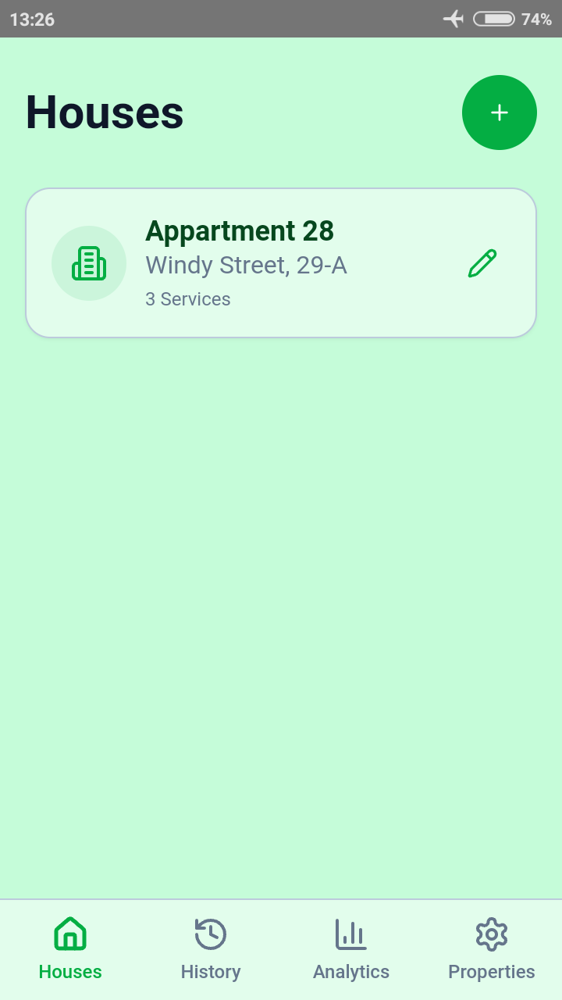
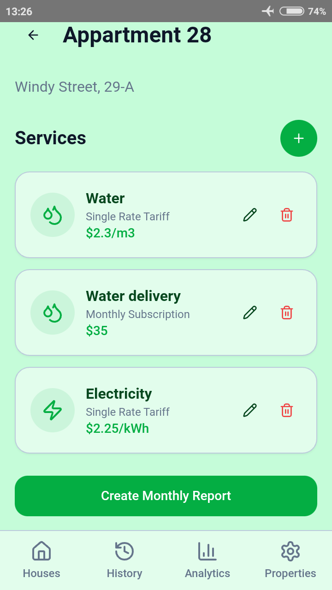
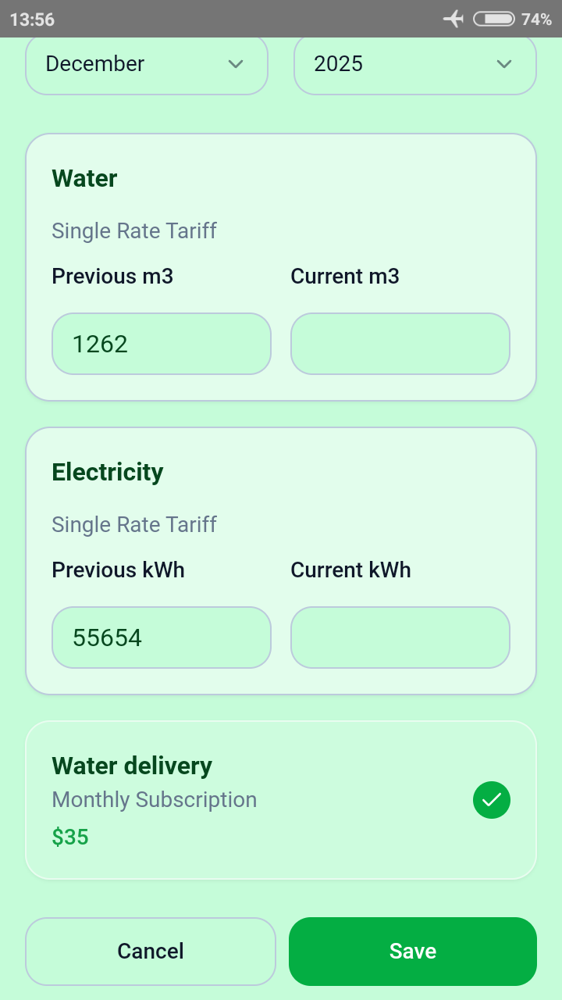
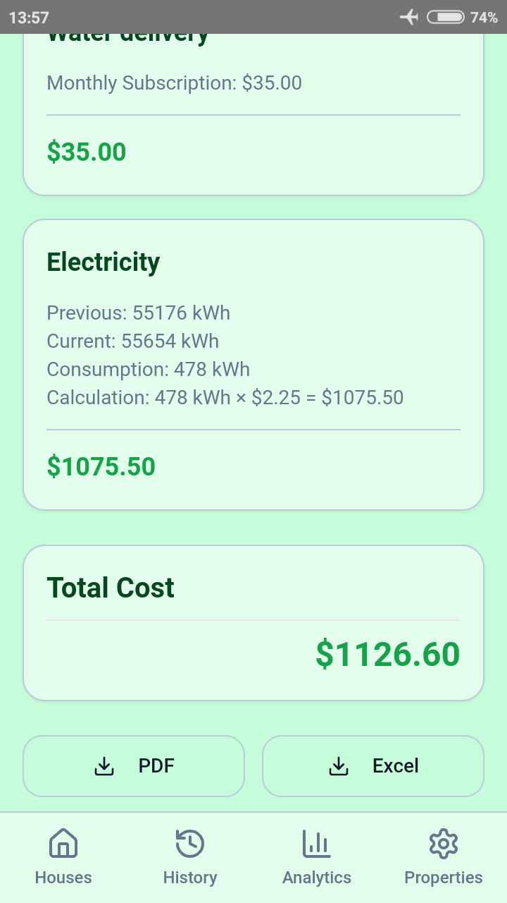

## Utility Calculator - Your Utility

**A simple and intuitive web app for tracking home utilities, meter readings, and monthly expenses.**

The main idea behind this app is to provide a convenient alternative to Excel spreadsheets for tracking utilities. Once all services are set up, you only need to enter the current meter readings (the previous period is filled in automatically) and save the report. All data is preserved for previous months.

---

## 🌐 Live Demo

https://nuance777.github.io/YourUtility/

---

## 📸 Preview

  
  
  
  

---

## ✨ Features

- Track electricity, water, gas, and other utilities  
- Add and manage meter readings  
- View monthly expense summaries  
- Export reports (PDF / Excel)  
- Responsive design for mobile and desktop  
- Multi-language support: Deutsch, English, Espanol, Francais, Italiano, Portugues, Russian, Ukranian
- Backup & Restore
- Support for multiple color themes, including light and dark modes

---

## 📱 Android App

You can also use this application on Android devices.

👉 Download it here:
https://nuance777.itch.io/your-utility

Enjoy tracking your utilities on the go!

---

## ▶️ How to Use

1. Open the live demo link  
2. Add your utilities (e.g. electricity, water, gas)  
3. Enter your meter readings  
4. Track your monthly usage and expenses  
5. Export reports if needed  

---

## 📦 About This Repository

This repository contains the production build of the application, generated for deployment via GitHub Pages.

The source code is maintained separately.

---

## 🚀 Deployment

The app is hosted using GitHub Pages and served as a static website.

📄 License

MIT
