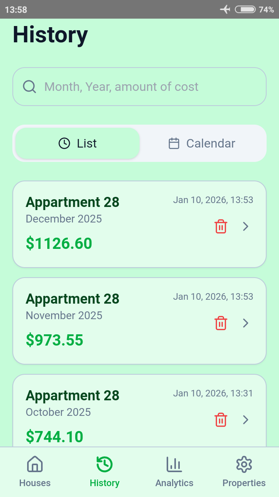
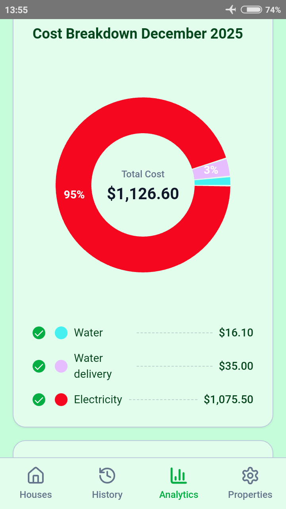

## Utility Calculator - Your Utility

**A simple and intuitive web app for tracking home utilities, meter readings, and monthly expenses.**

The main idea behind this app is to provide a convenient alternative to Excel spreadsheets for tracking utilities. Once all services are set up, you only need to enter the current meter readings (the previous period is filled in automatically) and save the report. All data is preserved for previous months.

You can install this app directly from your mobile browser - no app store required. Works offline after installation.
1. Open the app in your browser  
2. Tap “Add to Home Screen”  
3. Use it like a regular app, even offline
---

## 🌐 Open the App

https://nuance777.github.io/YourUtility/

---

## 📸 Preview

  
  
  
  
  
  

---

## ✨ Features

- Track electricity, water, gas, and other utilities  
- Add and manage meter readings  
- View monthly expense summaries  
- Export reports (PDF / Excel)  
- Responsive design for mobile and desktop  
- Multi-language support: Deutsch, English, Espanol, Francais, Italiano, Portugues, Russian, Ukranian
- Backup & Restore
- Support for multiple color themes, including light and dark modes

---

## 📱 Android App

You can install this app on Android devices using an APK file (no Google Play required).

👉 Download the APK:
https://nuance777.itch.io/your-utility

**How to install:**
1. Download the APK file  
2. Open it on your device  
3. Allow installation from unknown sources if prompted  
4. Install and enjoy the app

---

## ▶️ How to Use

1. Open the App link in your browser
2. Add house and your utilities (e.g. electricity, water, gas)  
3. Enter your meter readings and save the report
4. Track your monthly usage and expenses  
5. Export reports if needed  

---

## 📦 About This Repository

This repository contains the production build of the application, generated for deployment via GitHub Pages.

The source code is maintained separately.

---

## 🚀 Deployment

The app is hosted using GitHub Pages and served as a static website.

📄 License

MIT
